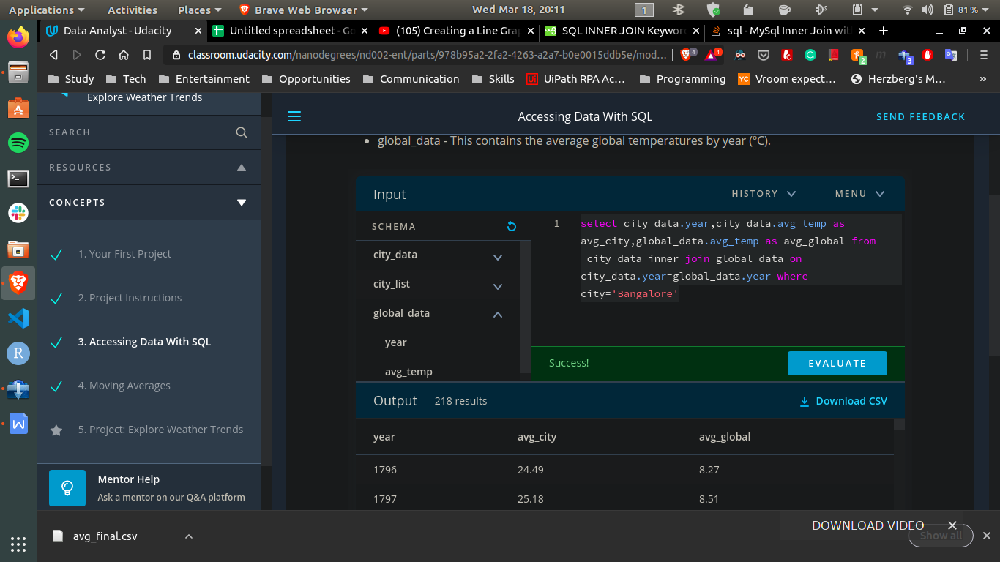
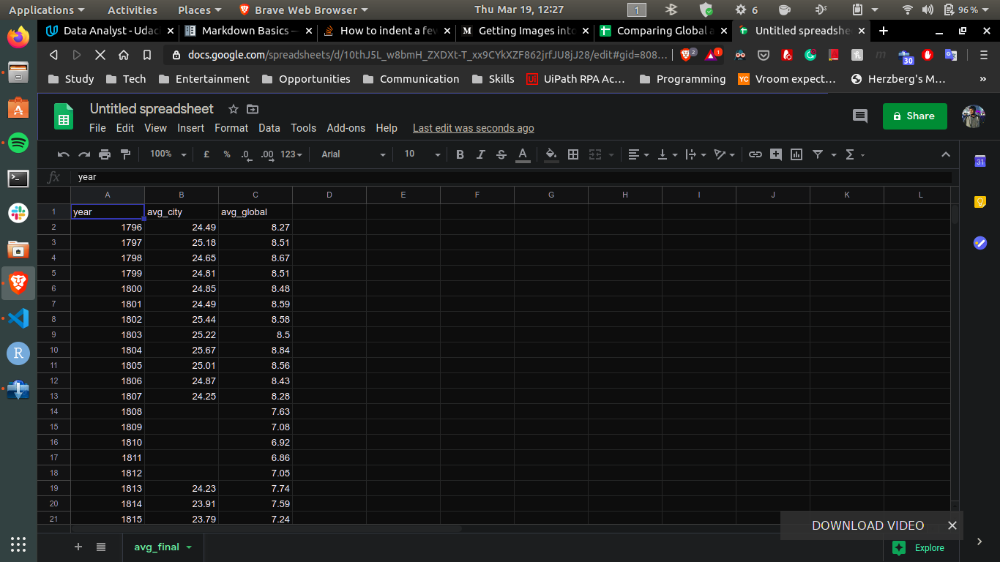
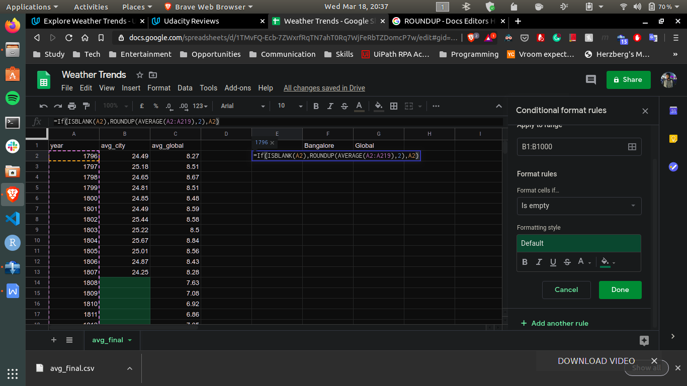
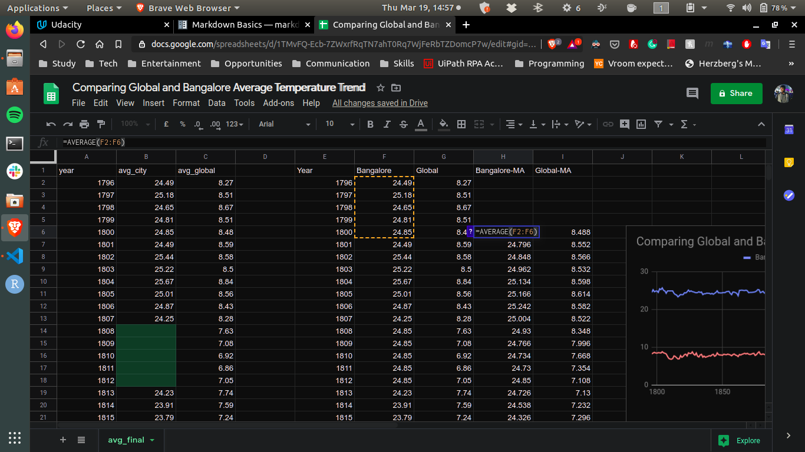
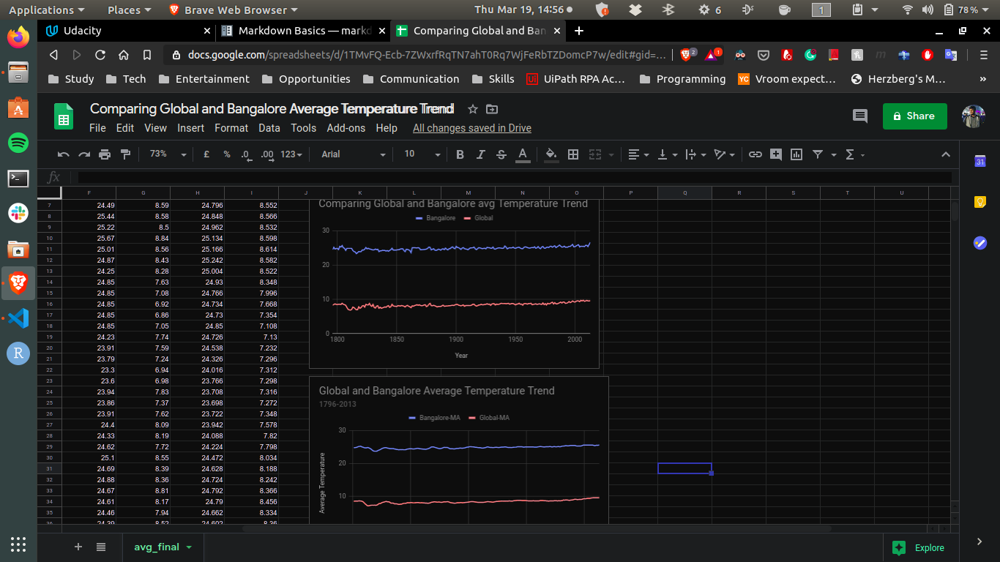

# Analysis and Comparing Global and Bangalore City Average Temperature Trend:

## STEP-1:
&nbsp; &nbsp; &nbsp; &nbsp; I used the data base provided by the udacity which consists of three relations named **city_list,&nbsp; city_data,&nbsp; global_data** and extracted required data which is to be used for comparing trends. 

after observing that number of rows in Global_data are more than number of rows in city_data for Banglore. I extracted only data of years which are common in both city_data and global_data for accurate comparison rather than replacing missing data with mean value which is considered as best alternative for missing values.

### QUERY USED:
 &nbsp; &nbsp; &nbsp; **SELECT city_data.year,city_data.avg_temp AS avg_city,global_data.avg_temp AS avg_global FROM city_data INNER JOIN global_data ON city_data.year=global_data.year WHERE city='Bangalore'**
 

- downloaded the output of my query as a csv file.
- Imported the csv file to a google sheet. 

 - - - 
## STEP-2:
&nbsp; &nbsp; &nbsp; &nbsp; I Replaced the missing values in present dataset by the mean value of its column. 

function used to replace missing values by mean values is : **=If(ISBLANK(A2),ROUNDUP(AVERAGE(A2:$A219),2),A2)** and applied it to whole average temperature columns

- -  -
## STEP-3:   
 &nbsp; &nbsp; &nbsp; &nbsp;    I created a line chart comparing Global and bangalore city average temperatures. In order to smooth out the lines and make trends more observable I computed 5-year Moving Averages.

### FUNCTION USED: 
 &nbsp; &nbsp; &nbsp; **=AVERAGE(F2:F6)** and applied it to both of the average temperature columns.

 

 

- - -
## FINAL CHART:

- - -

## OBSERVATIONS:
   * The biggest difference between “Bangalore-MA” and “Global-MA” is **17.7** at **1812**.
   * The Global and Bangalore average temperature trends have a positive correlation coefficient of **0.79**.
   * Least Global and Bangalore average temperatures are  **6.86** and **23.3** respectively.
   * Mean Global and Bangalore average temperatures are **8.40** and **24.85**
   respectively.
   * For every increase of **100** in Year, “Global Moving Average” increases by about **0.674**.

